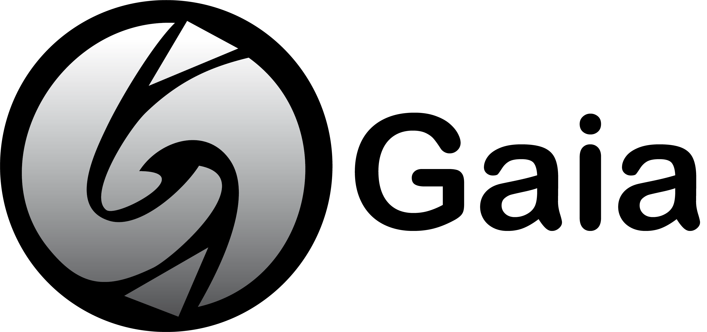

# Description

**GAIA (c)** is a data-oriented game engine by **Spicy Noodles Studio (c)** designed with simplicity in mind, so that anyone can begin creating new games and experiences with some basic **C++** knowledge without worrying about the boring stuff.

We give you the tools to **render 3D models** and worlds, to implement animations and effects, to set up **blueprints and components**, to use your favourite game controllers... Everything ready from the get-go, with no additional coding needed. But check for yourself all the features that GAIA Engine puts in your hands.

# Features

- 3D rendering system complete with shaders and textures.
- Support for animations and particles, including trails.
- Full physics system with rigidbody support, triggers and colliders.
- A gameObject-Component structure designed for ease of use.
- Input system with keyboard, mouse, controller support and event-handling.
- A complete sound system that offers both 2D and 3D audio with reverb and effects.
- It supports blueprints.

# How to Install

- Download GAIA.
	- Download the most recent release version. **DO NOT** download the master version, only release versions are stable.
- Set up GAIA:
	- Inside 'Dependencies', use CMAKE to install the following tools: Ogre3D, FMOD, CEGUI, SDL2.0, Bullet Physics.
	- Go to the properties of GAIA, get into 'Configuration Properties >> Debugging >> Work Directory' and change it's value to **$(TargetDir)** in debug and release.
	- Inside GAIA, run the DLLCopier, both in debug as in release, to install the necessary tools for the engine.
	- Now compile GAIA both in debug as in release. Debug is used for code / game testing purposes, and release for the final stable version of the game.
- Set up your game Project:
	- Create a Visual Studio project in c++.
	- Inside the folder with your .exe, create a 'Gaia' folder and move inside your compiled GAIA project from the previous step.
	- Create a main.cpp file. It should look like this in order to start and employ the engine:
```
#include <GaiaCore.h>

#ifdef _DEBUG
#include <cstdlib>
#include <crtdbg.h>
#define _CRTDBG_MAP_ALLOC
#endif

#ifdef _DEBUG
int main()
#else
#include <Windows.h>
int WINAPI
WinMain(HINSTANCE hinstance, HINSTANCE prevInstance, LPSTR lpCmdLine, int nCmdShow)
#endif
{
#ifdef _DEBUG
	_CrtSetDbgFlag(_CRTDBG_ALLOC_MEM_DF | _CRTDBG_LEAK_CHECK_DF);
	//_CrtSetBreakAlloc(94345);
#endif	

	GaiaCore* g = new GaiaCore();
	g->init("4 Pong Arena");
	g->run();
	g->close();
	
	delete g;

	return 0;
}
```

# How to Use

 - Next to the executable you should have:
	 - Assets folder (just like in the Gaia project)
	 - window.cfg file
	 - plugins.cfg file
	 - resources.cfg file
	 - resources.asset file

**We recommend to copy the files given in the Gaia version downloaded.**

- If you do as recommended, you should only navigate through the Assets folder and place in its place all kind of resources you need.
- To **create a scene**, you just have to go to **Assets/Scenes**, create a **<*YourSceneName*>.scene** and go to **Assets/Files/scenes.asset** and write scene location on it. **(Remember that the order matters, the first written path will be the first scene to initialize)**.
	- Scenes are defined in plain text with the following format:
		```
		"SceneName": "Game",
    		"SceneObjects": [
        	{
            		"ObjectType": "BLUEPRINT",
            		"ObjectName": "name",
            		"Tag": tag
            		"BlueprintPath": "blueprintName"
        	},
        	{
            		"ObjectType": "GAMEOBJECT",
            		"ObjectName": "name",
            		"Tag": "tag",
            		"Components": 
            		[
                		{
                    		"ComponentName" : "name",
				"ComponentProperties": [
                        		["attribute" , "value"],
                        		["attributeVector" , "value1 value2 value3"]
                    		]
                		}
            		]
        	},
		]
		```
- To create a blueprint, you have to go to **Assets/Blueprints**, create a **<*YourBlueprintName*>.blueprint** and go to **Assets/Files/blueprints.asset** and register the blueprint location on it.
- To **create a component**, in your own game project, create a class that inherits from UserComponent. There you can define for your game logic:
	- `awake()`
	- `start()`
	- `preUpdate(float deltaTime)`
	- `update(float deltaTime)`
	- `postUpdate(float deltaTime)`
	- more
- Once you create a component, **remember to register it** using 'REGISTER_FACTORY(YourComponentNameID);' on the .cpp so that Gaia recognizes your component.
	- You need to include the following header into the code in order to access the factory: **#include <ComponentRegister.h>**.
- To **create a sound**, save any kind of sound file (.mp3, .wav, .ogg, etc) in your **Assets/Sounds** folder, and register it's location on **Assets/Files/sounds.asset** for it to be loaded into the project.
- To **create an interface or menu**, you have to create a .layout file in the **Assets/UI/layouts** folder. It will be loaded automaticaly so that you only need to call it's route inside the code.
	- The Interface System is a wrapper of the CEGUI library. For further refining, documentation, tutorials or guides, you can check [the CEGUI wiki](http://cegui.org.uk/wiki/).
- To load **meshes and skeletons**, you can create them from an external tool such as Blender, and then store them in the **Assets/Meshes** folder.
	- **Animations** are defined within the .skeleton and are called from the program via the **Animator** component, pre-built into GAIA.
- To load **textures**, save the image file (preferably as .png) inside **Assets/Textures**.
- To create **materials, shaders, trails and particles**, GAIA follows the OpenGL/Ogre3D standard, which can be checked in the [Ogre3D wiki]() for further reference. To load them, just save the **.material**, **.particle**, **.trail** or shader files (**.glsl, .compositor, .material**) inside of their respective folders in **Assets**.

# Licenses

GAIA has been designed and created **by Spicy Noodles(c)**, all rights reserved.

GAIA Engine is powered by the following tools: 
- Ogre3D (Copyright (c) 2000-2013 [Torus Knot Software Ltd](https://www.ogre3d.org/))
- Bullet Continuous Collision Detection and Physics Library (Copyright (c) 2003-2006 [Erwin Coumans](https://pybullet.org/Bullet/phpBB3/))
- FMOD Studio (Copyright (c) [Firelight Technologies Pty Ltd.](https://www.fmod.com/))
- SDL 2.0 (Copyright (c) [SDL Community](http://hg.libsdl.org/SDL))
- CEGUI (Copyright (c) [The CEGUI Team](http://cegui.org.uk/wiki/))